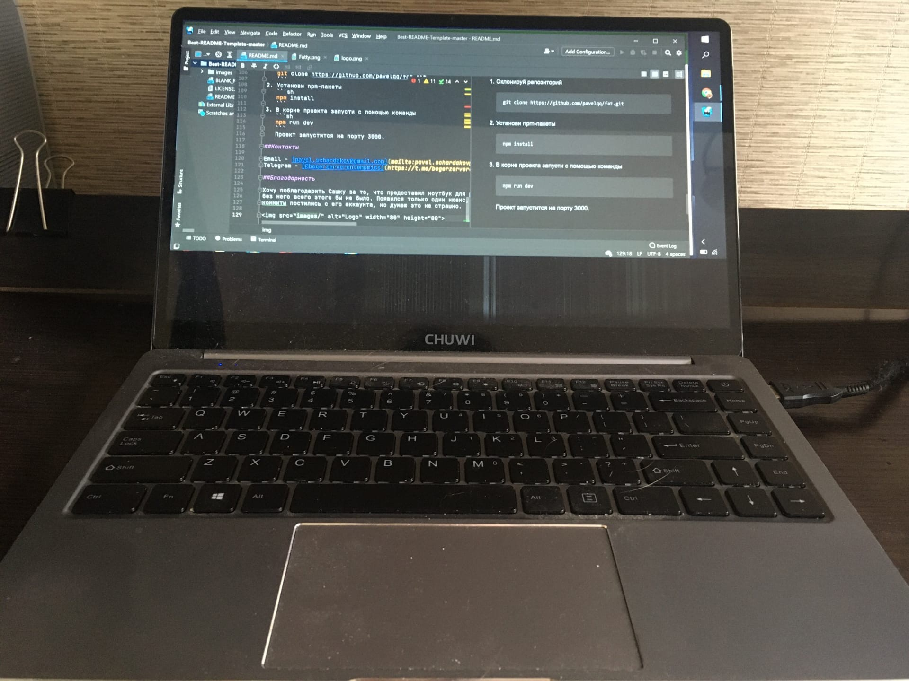

<br />
<p align="center">


  <h3 align="center">Спортивная социальная сеть</h3>

  <p align="center">
    Это проект, позволяющий людям достичь спортивных целей через подбор подходящего плана тренировок и диеты, начиная 
от офисных работяг, заканчивая профессиональными спортсменами.
    <br />
    <a href="https://fatclient.herokuapp.com/"><strong>Посмотреть демо »</strong></a>
    <br />
    <br />
    <a href="https://t.me/begerzerverentempmiss">Телеграм автора</a>
    ·
    <a href="https://github.com/pavelqq/fatAPI">API проекта</a>
    ·
    <a href="https://github.com/pavelqq/fat/branches">История коммитов</a>
  </p>
</p>

<details open="open">
  <summary>Оглавление</summary>
  <ol>
    <li>
      <a href="#О проекте">О проекте</a>
      <ul>
        <li><a href="#Технологии">Технологии</a></li>
      </ul>
    </li>
    <li>
      <a href="#Локальный запуск">Локальный запуск</a>
      <ul>
        <li><a href="#Необходимая среда">Необходимая среда</a></li>
        <li><a href="#Установка">Установка</a></li>
      </ul>
    </li>
    <li><a href="#Контакты">Контакты</a></li>
    <li><a href="#Благодарность">Благодарность</a></li>
  </ol>
</details>

## О проекте

[comment]: <> ([![Product Name Screen Shot][product-screenshot]]&#40;https://fatclient.herokuapp.com/presentation&#41;)
___
Концепция проекта заключается в подборе идеальной программы тренировок и диеты для пользователя. Это происходит,
благодаря постоянному взаимодействию пользователей между собой.

Выбрав план, они дают "фидбек" по нему, другие
пользователи могут посмотреть статистику плана и узнать насколько эффективно будет следовать ему. Планы можно создавать
самому или воспользоваться чужим. 

Данным сервисом предполагается использование не только простых обывателей, но и
профессиональными спортсменами, которые могут "вести" своих клиентов за деньги или бесплатно помогать другим
пользователям. Для реализации всего выше перечисленного сервис предоставляет множество возможностей: чат, профиль
со "стенкой", комментарии, различные статистики. Концепция сервиса также подразумевает соревновательный интерес.
Можно следить как за своими успехами, так и за успехами других пользователей.
___

### Технологии

Здесь перечисленны технологии, которые использованы для создания
клиентского приложения:
* [HTML]() - based
* [CSS]() - И это тоже база, разве есть нормальные альтернативы?)
* [Material-UI]() - UI-библиотека, которая очень помогла с версткой в проекте. Вместо придумывания
  ненужных "велосипедов", ускорила верстку проекта.
* [JavaScript]() - Поскольку я хорошо знаю JS, стал писать на нём 
* [React.js]() - Проще работать с интерфейсом и его состоянием. 
* [Redux]() - В большом приложении без стейт менеджера никуда не деться, иначе будет большое спагетти, чтобы
  достать состояние в любой точке приложения.
* [redux-thunk]() - Если пользователь будет много тык-тык на странице, то будет много вызовов в СТМ, а
  т.к. редакс работает синхронно, то нужна прослойка, которая будет выполнять операции асинхронно.
* [Axios]() - HTTP-запросы.
* [moment.js]() - Работа с датами.
* [node-sass]() - Поэкспериментировал с SCSS. 
* [react-chartjs-2]() - Графики.
* [draft.js]() - Текстовый редактор. Позволяет пользователям отправлять форматированный текст.
* [react-router]() - Навигация в приложении.
* [react-router-config]() - Эксперименты с роутингом, понравилась концепция роутинга по заданному конфигу.
* [react-toastify]() - Всплывающие уведомления, хоть и в Material-UI есть аналоги, но мне понравился больше этот вариант
* [uuid]() - Генератор уникальных идентификаторов.
* [react-perfect-scrollbar]() - Кастомный скролл, просто красивая декорация.

В принципе в **package.json** есть много других библиотек, но это либо эксперименты не вошедшие в релиз, либо заготовки на
будущее.


## Локальный запуск

Чтобы запустить копию проекта локально на компьютере, следуйте инструкциям ниже.

### Необходимая среда

Установите менеджер пакетов **npm**
  ```sh
  npm install npm@latest -g
  ```

### Установка

1. Склонируй репозиторий
   ```sh
   git clone https://github.com/pavelqq/fat.git
   ```
2. Установи npm-пакеты
   ```sh
   npm install
   ```
3. В корне проекта запусти с помощью команды
   ```sh
   npm run dev
   ```
   Проект запустится на порту 3000.

## Контакты

Email - [pavel.schardakov@gmail.com](mailto:pavel.schardakov@gmail.com)
Telegram - [@begerzerverentempmiss](https://t.me/begerzerverentempmiss)

## Благодарность
***Хочу поблагодарить Сашку за то, что предоставил ноутбук для работы над этим проектом,
без него всего этого бы не было. Появился только один нюанс, я забыл про SHH ключ, и все
коммиты постились с его аккаунта, но думаю это не страшно.***
<br/>

